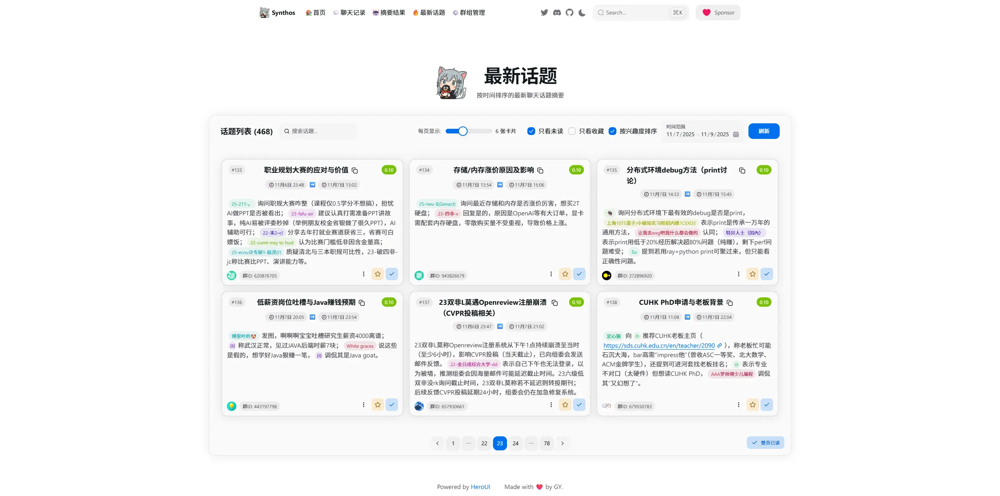
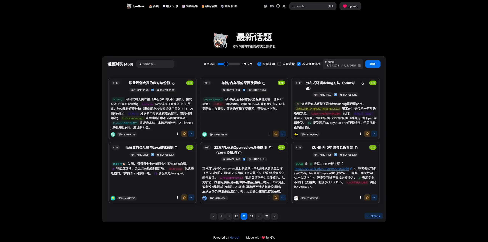
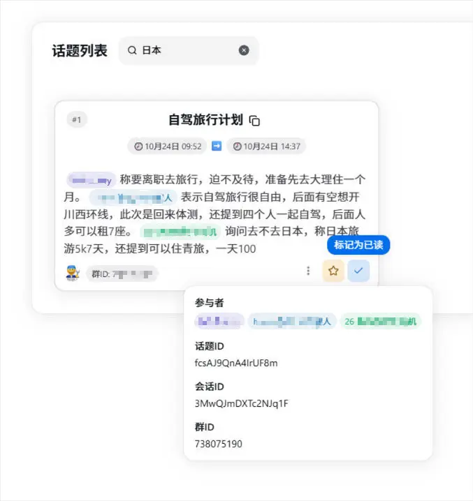
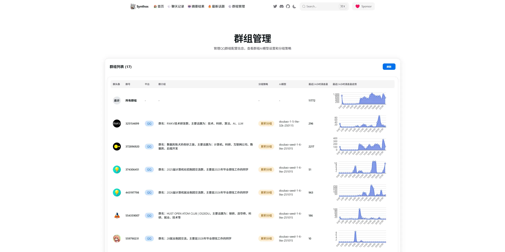
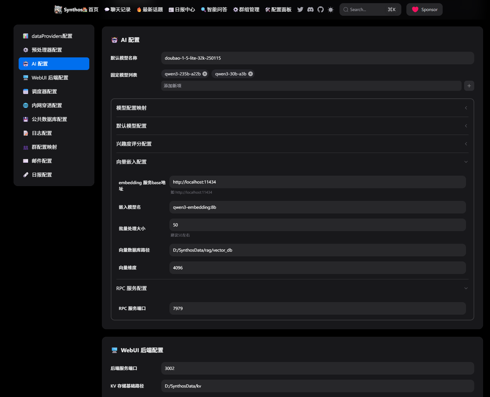
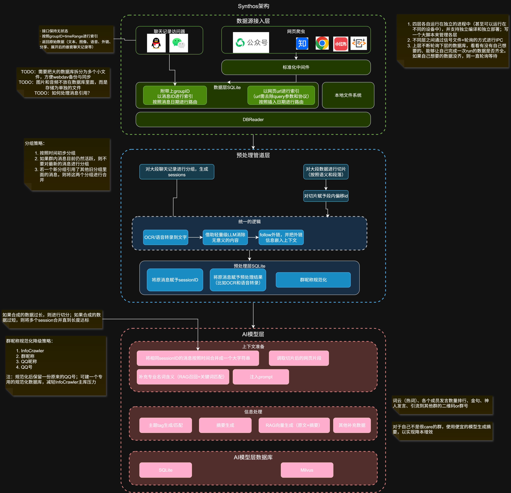
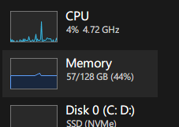

# Synthos：智能聊天记录全链路分析系统

[](https://deepwiki.com/g122622/synthos)

## 项目简介

Synthos 是一个基于 `Node.js` 和 `TypeScript` 构建的智能聊天记录分析系统，专注于 QQ 聊天记录的全链路数据处理与 AI 总结功能。项目采用现代化的 Monorepo 架构，融合自然语言处理、向量模型、任务调度与 Web 前端展示，为用户提供从原始聊天记录导入、上下文理解、兴趣度分析到可视化摘要输出的一站式解决方案。

无论是个人用户希望回顾重要对话，还是团队管理者需要洞察群聊趋势，Synthos 都能通过 AI 赋能，**让分散在不同群聊、不同时间的海量聊天信息变得可读、可查、可理解，将流式、易失的聊天记录沉淀为结构化、持久化的个人专属知识库**。

> ## 声明
>
> 1. Synthos 项目的启动目的是为了减轻手动阅读和管理巨量群聊信息的负担，不负责验证这些信息的完整性、准确性、时效性、合规性，不保证使用这些信息而获得的结果。对于有害信息造成的负面影响，作者亦不承担任何责任。
> 2. Synthos 通过非官方技术手段解密并解析 QQ 的本地消息数据库来获取群聊消息。在读取数据库的过程中，会全程保持只读，不会对用户数据完整性造成损坏；由于 Synthos 采用旁路方式非侵入式的获取群聊消息，因此被官方检测到并封号的风险极低。

---

## 界面展示

亮色模式：  


暗黑模式：  


细节交互：  


群组管理界面：  


配置面板


---

## 系统架构



Deepwiki: [https://deepwiki.com/g122622/synthos](https://deepwiki.com/g122622/synthos)

---

## 核心功能特性

- **智能预处理**：自动分组、上下文拼接、引用消息追踪
- **AI 摘要生成**：基于 云端/本地 模型生成高质量对话摘要
- **兴趣度指数**：用户可设置关键词偏好，系统为每个话题打分排序（支持负向反馈）
- **历史记录自动拉取**：支持增量同步与历史回溯
- **日报自动生成**：每日汇总高价值讨论内容
- **多群组管理**：灵活配置不同群组的分析策略

### Agent 对话（流式）

- WebUI 对外提供 Agent 问答能力，并支持 **REST SSE（`POST /api/agent/ask/stream`）** 全流式输出。
- 事件协议为稳定业务事件：`token` / `tool_call` / `tool_result` / `done` / `error`（用于前端展示 token 与工具调用过程）。
- 单实例并发保护：同一 `conversationId` 不允许并发双发（冲突时返回 HTTP `409`）。

接口细节（请求参数、事件格式、time-travel 接口等）见：[docs/接口文档/API文档.md](./docs/接口文档/API文档.md)

> **TODO愿望单**  
>
> - [TODO] 转发聊天记录跟随  
> - ✅ 已完成 引用聊天记录跟随  
> - [TODO] 主动拉取历史聊天记录（⚠️目前技术实现遇到困难）
> - ✅ 每天生成日报
> - ✅ 简单易用的设置面板
> - ✅ 已完成 将兴趣度打分后端模型迁移至ollama的bge-m3，以利用GPU加速
> - ✅ 支持在打分或者rag向量生成时，自动将群昵称替换为类似"用户1"这样的昵称，避免抽象昵称影响模型理解
> - ✅ 已完成 用户输入rag问题后，先让llm生成查询计划（Multi-Query），然后再查向量数据库，并对结果去重
> - ✅ 构建rag问答上下文时，插入当前日期和每个话题的日期，以提高模型回答的准确性
> - ✅ RAG前端问答页面支持 1. 解析话题，并在鼠标hover后自动展示话题详情浮层 2. 渲染markdown 3. 支持全文复制
> - ✅ RAG支持记忆历史会话
> - ✅ 已完成 init() 防重入
> - [TODO] 支持根据nickname反查qq号，进而展示头像
> - [TODO] 支持按照群友发言数量排名（可按照群、时间段等筛选）、分析根据每个群友的发言内容生成群友画像
> - [TODO] 预处理支持对图片进行ocr和vllm识别
> - ✅ 生成摘要、回答等场景的上下文补充背景知识（使用关键词检索来召回）
> - [TODO] 上下文中间件支持补充链接查询结果
> - [TODO] 上下文中间件支持过滤违禁词
> - ✅ 后端子项目可以监听代码变动，进行HMR
> - [TODO] 支持可视化任务编排
> - [TODO] 支持进行关键词or语义实时监听群内消息，并快速发邮件通知
> - ✅ 支持监控各个模块的CPU和内存占用、支持监控存储空间占用。将这些数据持久化，并可通过前端看到趋势图，以及通过健康检测接口看到实时值。
> - ✅ 已完成 兴趣度指数：用户给出自己的兴趣偏好（关键词标签组），系统根据用户的兴趣偏好为每个话题打分，排序后推荐给用户。（用户也可以标记不喜欢的话题，此时话题得分为负数）
> - ✅ 已完成 向量嵌入与语义检索：基于 Ollama + bge-m3 生成话题向量嵌入，支持 RAG 语义搜索

---

## 技术架构

### 核心技术栈

- **🧑‍💻语言**：纯 TypeScript + Node
- **🎯项目管理**：Pnpm + Monorepo
- **🐳容器化/部署（WIP）**：Docker Compose + Nginx（前端静态托管 & /api 反代）
- **💬RPC库**：tRPC
- **💉依赖注入框架**：TSyringe
- **🕗任务调度与编排框架**：node-cron + tRPC 跨进程调用
- **📚数据库**：SQLite（聊天记录 & ai生成数据存储） + LevelDB（KV元数据存储） + sqlite-vec（向量索引存储）
- **📦向量数据库**：基于 better-sqlite3 + sqlite-vec 的轻量级向量存储方案
- **🤖LLM框架**：Langchain，支持任意云端 LLM or 本地的 Ollama
- **🧪测试框架**：Vitest  
- **🌏Web 后端框架**：Express
- **⚛️Web 前端框架**：React + ECharts + HeroUI + Tailwind CSS

### 模块划分

| 模块 | 职责 |
|------|------|
| `data-provider` | 从 QQ 等 IM 平台获取原始聊天记录 |
| `preprocessing` | 清洗、分组、上下文拼接、引用解析 |
| `ai-model` | 文本向量化、主题提取、摘要生成、兴趣度计算、向量嵌入存储与检索（RAG） |
| `orchestrator` | Pipeline 调度器，按顺序串联执行各数据处理任务（ProvideData → Preprocess → AISummarize → GenerateEmbedding → InterestScore） |
| `webui-backend` | 提供 RESTful API，支持群组管理、消息查询、结果获取 |
| `common` | 共享类型定义、配置管理、数据库工具、日志系统 |

---

## 快速开始

> ⚠️ **推荐硬件配置**  
>
> - 由于需运行 Ollama 服务（选配），加上 Node 进程和 SQLite 实例，**建议内存 ≥16GB**。
> - 中端 CPU
> - 【选配】支持 CUDA 的 GPU（如果 llm 和嵌入模型都使用云端服务，则无需本地 GPU）
> - 10G以上剩余硬盘空间。



### 1. 环境准备


#### 安装 Ollama 并下载 bge-m3 模型（用于 RAG 向量检索）

项目使用 Ollama 部署 `bge-m3` 模型生成 1024 维嵌入向量，用于话题的语义检索。

1. **安装 Ollama**：访问 [Ollama 官网](https://ollama.ai/) 下载并安装

2. **拉取 bge-m3 模型**：

```bash
ollama pull bge-m3
```

1. **确保 Ollama 服务运行**：默认监听 `http://localhost:11434`

> 💡 **提示**：Ollama 服务会在系统启动时自动运行。如需手动启动，执行 `ollama serve`。

#### 准备配置文件

在项目根目录创建 `synthos_config.json`，格式请参考 [`./common/config/@types/GlobalConfig.ts`](.\common\config\@types\GlobalConfig.ts)。  
QQ 数据库密钥配置方法详见：[https://docs.aaqwq.top/](https://docs.aaqwq.top/)

附：**向量嵌入相关配置示例**（配置文件中的 `ai.embedding` 和 `ai.rpc` 部分）：

```json
{
  "ai": {
    "embedding": {
      "ollamaBaseURL": "http://localhost:11434",
      "model": "bge-m3",
      "batchSize": 10,
      "vectorDBPath": "./data/vectors.db",
      "dimension": 1024
    },
    "rpc": {
      "port": 7979
    }
  },
  "orchestrator": {
    "pipelineIntervalInMinutes": 60
  }
}
```

| 配置项 | 说明 | 默认值 |
|--------|------|--------|
| `ollamaBaseURL` | Ollama 服务地址 | `http://localhost:11434` |
| `model` | 嵌入模型名称 | `bge-m3` |
| `batchSize` | 批量生成向量的大小 | `10` |
| `vectorDBPath` | 向量数据库存储路径 | - |
| `dimension` | 向量维度（需与模型匹配） | `1024` |
| `rpc.port` | RAG RPC 服务端口 | `7979` |

> 💡 **运维建议**：数据无价，项目运行中产生的 SQLite、LevelDB 数据库以及向量数据库建议定期执行"3-2-1"备份策略（3份副本、2种介质、1份异地），防止数据丢失。
>
### 2. 启动项目

#### 方式一：使用新的 HMR 开发模式（推荐）⚡

所有后端子项目现已支持**热重载（HMR）**功能，代码修改后会自动重新编译并重启服务，无需手动操作。

```bash
# 1. 安装monorepo依赖
pnpm i # 这不仅会安装根目录下的依赖，还会自动安装所有子项目的依赖

# 2. 启动所有服务（含前后端，支持热重载）
pnpm dev:all

# 或者，仅启动后端服务（不含前端）
pnpm dev:backend

# 或者，仅启动配置面板（轻量级模式）
pnpm dev:config

# 或者，启动完整服务 + 公网转发
pnpm dev:forwarder
```

---

## Docker 部署（WIP，暂不推荐）

该方案将 `orchestrator` / `preprocessing` / `ai-model` / `webui-backend` / `webui-frontend` 容器化，
`data-provider` 仍在宿主机运行（因为其依赖本机 QQNT 数据库与 VFS DLL）。

### 1) 启动容器

```bash
docker compose up -d --build
```

可选启用 Ollama：

```bash
docker compose --profile ollama up -d --build
```

### 2) 在宿主机启动 data-provider（连接容器 Mongo）

> 注意：`docker-compose.yml` 中提供了一个 `host-only` profile 下的 `data-provider` 占位服务，仅用于提示该组件需在宿主机运行，并不会真正容器化该进程。

```bash
pnpm --filter data-provider dev
```

### 3) 访问 WebUI

- 前端（nginx）：http://localhost:8080
- 后端健康检查：http://localhost:3002/health
- AI RPC（tRPC HTTP/WS）：http://localhost:7979 （WS 同端口）

> 配置文件默认挂载为 `docker/config/synthos_config.json`（容器内路径：`/config/synthos_config.json`）。
> 如需自定义，可直接修改该文件，或使用 `synthos_config_override.json` 进行覆盖。
> 建议把敏感信息（如 `apiKey`/`dbKey`）放到 `synthos_config_override.json`（已被 gitignore），避免误提交。

**可用的启动脚本：**

| 命令 | 说明 | 包含的服务 |
|------|------|-----------|
| `pnpm dev:all` | 完整开发环境（推荐） | orchestrator, preprocessing, ai-model, data-provider, webui-backend, webui-frontend |
| `pnpm dev:backend` | 仅后端服务 | orchestrator, preprocessing, ai-model, data-provider, webui-backend |
| `pnpm dev:webui` | WebUI 开发模式 | ai-model, webui-backend, webui-frontend |
| `pnpm dev:config` | 配置面板模式 | webui-backend (配置模式), webui-frontend |
| `pnpm dev:forwarder` | 完整服务 + 公网转发 | 所有服务 + webui-forwarder |

**热重载特性：**

- ✅ **自动检测变化**：监听 `src/` 和 `common/` 目录的 `.ts` 和 `.json` 文件
- ✅ **快速重载**：修改代码后 2-5 秒内自动重新编译和重启
- ✅ **前端 HMR**：前端使用 Vite，支持极速的模块热替换（通常 < 1 秒）
- ✅ **并行启动**：所有服务并行启动，无需等待

#### 方式二：使用原有的启动脚本（兼容模式）

如果需要使用原有的串行启动方式（兼容性更好，但不支持热重载）：

```bash
# 启动所有服务（串行启动，间隔 3 秒）
npm run dev

# 或者，仅启动配置面板（轻量级模式）
npm run config
```

服务启动后，可通过以下方式验证：

- WebUI 后端：`http://localhost:3002`
- 健康检查接口：`GET /health`
- 配置面板：`http://localhost:5173/config`（仅启动配置面板时）

测试环境启用mock： `VITE_MOCK_ENABLED=true pnpm dev`

---

## API 与前端开发

- **API 文档**：详见 [`applications/webui-backend/docs/API文档.md`](.\applications\webui-backend\docs\API文档.md)
- **前端开发指引**：详见 [`applications/webui-backend/docs/前端开发指引文档.md`](.\applications\webui-backend\docs/前端开发指引文档.md)

核心接口包括：

- `GET /api/group-details`：获取群组列表
- `GET /api/chat-messages-by-group-id`：按群组查询消息
- `GET /api/ai-digest-result-by-topic-id`：获取 AI 摘要结果
- `GET /api/is-session-summarized`：检查会话是否已总结

---
