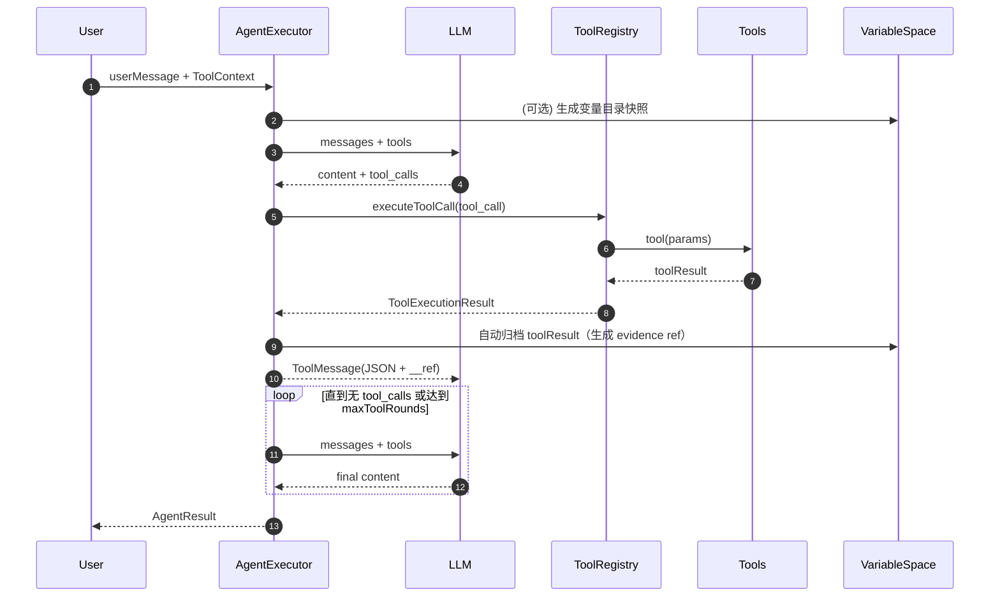

# Agent 系统设计（Synthos）

> 更新时间：2026-01-21

本文档系统性描述 Synthos 当前 Agent 子系统（主要位于 `applications/ai-model/src/agent`）的总体设计、关键组件、核心数据流、可追溯证据机制（`evidence.ref`）以及扩展方式。

## 1. 设计目标与约束

### 1.1 目标

- **工具驱动的可靠执行**：以 Function Calling 为主线，让模型在“思考/决策”与“工具执行”之间形成闭环。
- **可追溯的研究链路**：任何基于工具输出形成的结论，都能通过 `evidence.ref` 回溯到原始工具调用输出（可审计、可复用）。
- **可编程中间态复用**：提供 CAVM 风格“统一变量空间”，用于跨轮次、跨子任务保存中间结果。
- **在不侵入既有业务链路的前提下增强**：新增能力通过“新增工具/服务 + Agent 内部增强”接入，避免改动日报生成与 RAG 问答等既有调用链。

### 1.2 关键约束（工程侧）

- **TypeScript + tsyringe DI**：所有核心组件通过 DI 注入与管理。
- **不新增全局配置项**：变量空间存储复用 `webUI_Backend.kvStoreBasePath`。
- **避免引入不必要依赖**：并发控制与 JSON 段提取等尽量自实现。

## 2. 总体架构概览

Agent 子系统采取“单执行器 + 工具注册表”的架构：

- `AgentExecutor`：主执行循环（LLM 流式输出、工具调用、回填 ToolMessage、轮次控制）。
- `ToolRegistry`：工具的注册、参数归一化/校验、执行与错误封装。
- Tools：`rag_search` / `sql_query` / `web_search` 等业务工具；`var_*`/`deep_research` 等增强工具。
- `VariableSpaceService`：统一变量空间（KVStore 持久化 + per-session index）。
- `DeepResearchOrchestrator`：Planner 拆解 + 并发 Analysis 子任务（CoA 写入变量空间）。

### 2.1 执行时序（Function Calling 闭环）

## 3. 核心组件

### 3.1 `ToolRegistry`

职责：

- 保存 `ToolDefinition` 与 `executor` 的映射。
- 在执行前做 **参数归一化/兜底**（例如 `web_search` 缺 `query` 时用用户问题补全）。
- 参数必填校验，避免无意义的工具执行。
- 将工具执行结果统一包装为 `ToolExecutionResult`（success/result/error）。

### 3.2 `AgentExecutor`

职责：

- 维护消息列表 `messages`，驱动多轮 LLM 调用。
- 解析原生 tool calls；若模型不支持原生 tool calling，则使用 `ToolCallParser` 从文本中解析。
- 执行工具调用、回填 `ToolMessage`，直到得到最终回答或超出最大轮次。

**变量目录注入（CAVM 可见目录）**

- 当 `ToolContext.sessionId` 存在时，在 `messages` 中预留一个固定槽位 SystemMessage。
- 每轮调用前用 `VariableSpaceService.buildDirectoryForPrompt()` 替换该 SystemMessage，从而让模型“看见”可复用的变量 key 与摘要。

## 4. 统一变量空间（CAVM 风格）

### 4.1 设计

- 存储：`common/util/KVStore`（LevelDB）。
- Key 命名：
  - 变量条目：`agent:vars:${sessionId}:${key}`
  - 目录索引：`agent:vars:index:${sessionId}`
- 不依赖 KV 遍历：通过 per-session index（`key -> meta`）实现 `var_list`。

### 4.2 对外工具

- `var_set(key, value, summary?)`
- `var_get(key)`
- `var_list(prefix?, limit?)`
- `var_delete(key)`

## 5. 可追溯证据机制（evidence.ref 强约束）

### 5.1 为什么需要 `evidence.ref`

深度研究与多轮分析的核心问题是：**结论是否可回溯到证据来源**。为此系统要求：

- 当结论依赖工具输出时，必须提供可追溯引用：`evidence.ref`。
- 引用指向变量空间中的归档条目，任何时候都可以通过 `var_get(ref)` 找回“当时的原始工具输出”。

### 5.2 自动归档：工具输出 → 变量空间 → `__ref`

当 `ToolContext.sessionId` 存在时，`AgentExecutor` 会在每次工具调用完成后自动归档：

- 写入变量空间 key：
  - `evidence.tool_call.<toolCallId>`
- 值结构（示意）：
  - `toolName / toolCallId / toolArgs / success / result | error / archivedAt`
- 同时将该 key 作为 `__ref` 注入回工具输出（ToolMessage 的 JSON 内容中带上 `__ref` 字段）。

模型侧使用规则：

- 任何 `evidence.source` 为 `rag_search/sql_query/web_search` 的 evidence，必须将对应工具输出中的 `__ref` 原样复制到 `evidence.ref`。

### 5.3 深度研究中对 `evidence.ref` 的强校验

在 `DeepResearchOrchestrator` 的 Analysis 子任务阶段：

- 为 Analysis 子任务注入严格上下文标记 `__requireEvidenceRef=true`。
- 若归档失败（例如变量空间不可用），任务直接失败，避免产生“不可审计”的 CoA。
- 对模型输出的 CoA JSON 做校验：
  - 非 `llm` evidence 的 `ref` 必填。
  - `ref` 必须能 `var_get(ref)` 成功（变量存在）。
- 若校验失败，最多重试 1 次并追加更强约束提示词；仍失败则报错。

## 6. 深度研究（Planner + 并行 Analysis + CoA）

### 6.1 目标

将复杂问题拆解为多个可并行的子任务，通过多个 Analysis 子任务分别调用工具获取证据并输出结构化 CoA 块，为后续写作/汇总提供稳定中间产物。

### 6.2 产物落盘（变量空间）

- `deep_research.plan`：Planner 的拆解计划（JSON）
- `deep_research.coa.<taskId>`：每个任务的 CoA 块（JSON）
- `deep_research.coa_index`：CoA key 列表

### 6.3 并发模型

- 编排器内部实现并发限制（不引入额外依赖）。
- 并发度会被全局配置 `ai.maxConcurrentRequests` 上限约束，防止过载。

## 7. 扩展指南

### 7.1 新增工具（推荐路径）

1. 在 `applications/ai-model/src/agent/tools` 新增 `*Tool.ts`，实现 `getDefinition()` 与 `getExecutor()`。
2. 在 `applications/ai-model/src/di/tokens.ts` 增加 token。
3. 在 `applications/ai-model/src/di/container.ts` 注册 singleton。
4. 在 `applications/ai-model/src/agent/AgentInitializer.ts` 注册到 `ToolRegistry`。

### 7.2 新增编排能力（Orchestrator）

- 将复杂链路封装为 service（例如 `DeepResearchOrchestrator`），再通过一个 Tool 暴露给 Agent。
- 需要“强约束”时，可通过 `ToolContext` 添加内部标记（如 `__requireEvidenceRef`），但应避免污染外部业务上下文。

## 8. 已知限制与后续演进

- **Writer 两阶段写作尚未落地**：目前已能产出可追溯 CoA，但未实现从 CoA 自动汇总生成最终报告草稿的 Writer 阶段。
- **证据对象大小**：工具结果可能较大，当前会完整归档；若后续遇到存储与性能压力，可引入“摘要+外部对象存储”的分层策略。
- **更严格的 schema 校验**：当前主要做 `evidence.ref` 可追溯校验；后续可对 CoA JSON 做更严格的结构/字段校验。
